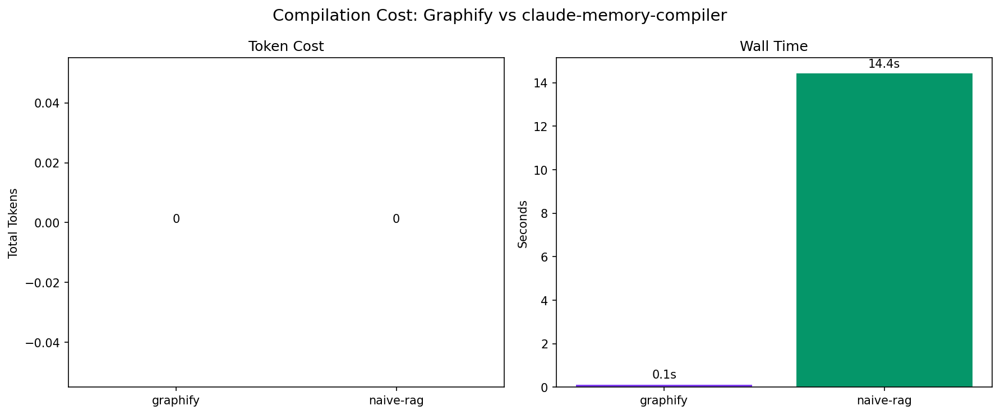
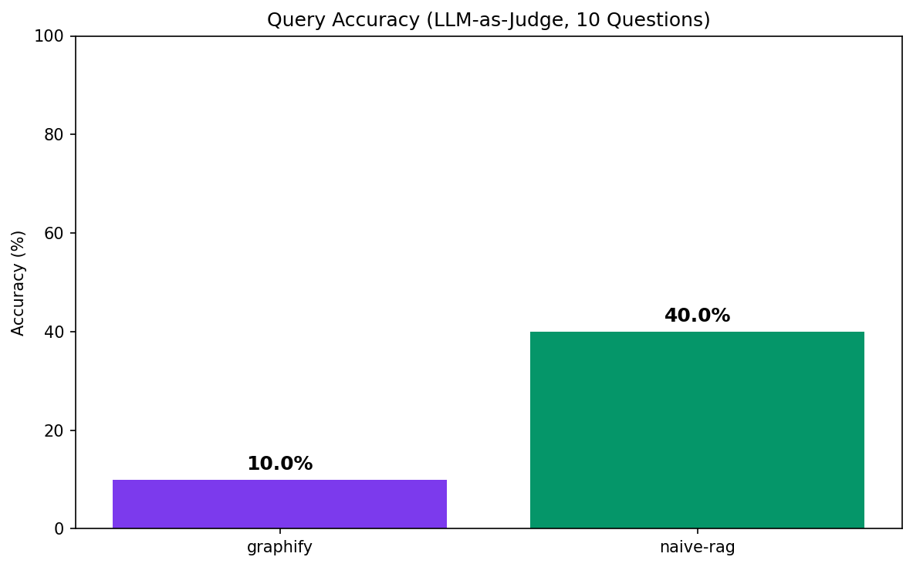
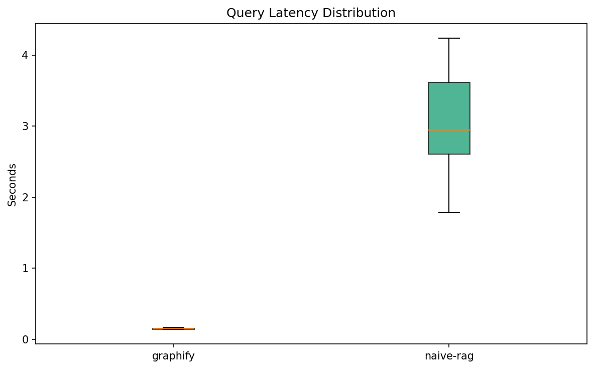

# llm-kb-bench

> Karpathy on Karpathy: benchmarking LLM knowledge base tools on their inspiration's own work.

A reproducible benchmark of LLM-compiled knowledge base tools. Same corpus, same metrics, same methodology, different tools.

## Results (v0.1)

| Metric | graphify | claude-memory-compiler |
|--------|----------|----------------------|
| Setup time | TBD | TBD |
| Compile tokens | TBD | TBD |
| Compile time | TBD | TBD |
| Storage size | TBD | TBD |
| Avg query tokens | TBD | TBD |
| Avg query latency | TBD | TBD |
| Accuracy | TBD | TBD |
| Drift detection | TBD | TBD |
| Output portable | TBD | TBD |
| Complexity (1-5) | TBD | TBD |

> Results filled after first benchmark run. Run `./scripts/run_all.sh` to reproduce.

### Charts





## Reproduce

```bash
git clone https://github.com/<owner>/llm-kb-bench
cd llm-kb-bench
pip install -e ".[dev]"
./scripts/run_all.sh
```

Requires: Python 3.10+, Anthropic API key (for LLM-as-judge grading).

## Corpus

Karpathy's public material, pinned by SHA256:
- **Repos:** nanoGPT, micrograd, llm.c
- **Blog posts:** Software 2.0, A Recipe for Training Neural Networks, Yes You Should Understand Backprop, Deep Neural Nets 33 Years Ago

~50 files. Mix of code, markdown, and prose. See [corpus/README.md](corpus/README.md) for details.

## Methodology

10 metrics measured per tool. Accuracy graded by Claude Sonnet using a strict 0-3 rubric with 20% human spot-checks. Full methodology: [METHODOLOGY.md](METHODOLOGY.md).

## Adding a Tool

1. Create `tools/<tool_name>/wrapper.py` implementing `ToolWrapper`
2. Register in `benchmarks/harness.py` `TOOL_REGISTRY`
3. Run `./scripts/run_all.sh`
4. Submit a PR

## License

MIT

## Author

Built by [Jothiswaran Arumugam](https://www.linkedin.com/in/jothiswaranarumugam) as part of [Jo's Cloud AI Hub](https://www.linkedin.com/newsletters/jos-cloud-ai-hub-7242091893717741568) newsletter research.
